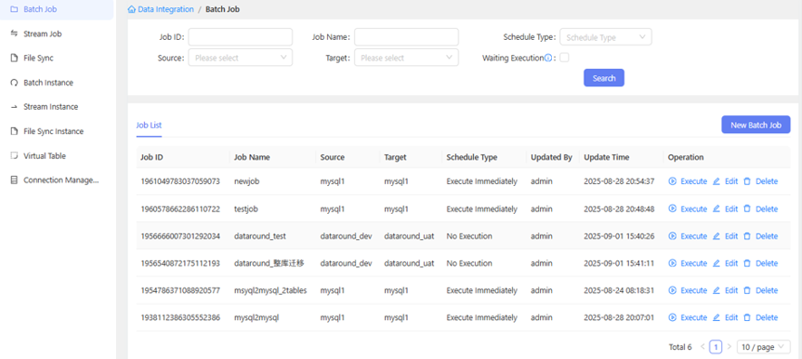
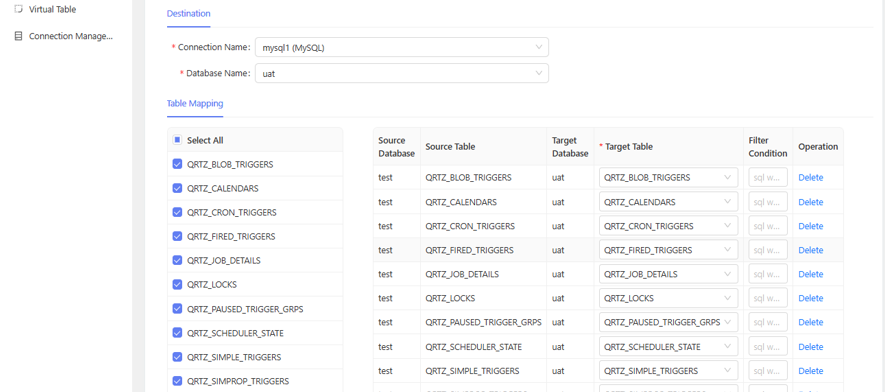

# Dataround link

Dataround link 是一个**开源数据集成工具**，专为多源异构数据同步而设计。它支持**结构化、半结构化和非结构化数据**的无缝集成和同步。

Dataround link 采用**零代码可视化**设计理念，无需配置文件或编程。用户可以通过直观的Web界面轻松配置和管理复杂的数据同步任务，真正实现数据同步的民主化。

## 核心特性

- **多源异构支持** - 统一支持结构化、半结构化和非结构化数据源
- **结构化数据支持** - 传统关系型数据库（MySQL、PostgreSQL、Oracle、SQL Server、TiDB等）
- **半结构化数据支持** - MongoDB、Kafka、JSON、XML等
- **非结构化数据支持** - 图片、视频、模型文件、文档和其他文件类型
- **零代码可视化界面** - 无需配置文件或编程，纯可视化操作
- **虚拟表支持** - 通过虚拟表将来自Kafka、Redis等的半结构化数据映射为结构化数据，实现与关系型数据库的同步
- **基于SeaTunnel** - Dataround link表数据同步功能基于Apache SeaTunnel实现，提供稳定可靠的数据传输能力

## 产品截图

### 作业管理仪表板


### 表映射界面



## 从源码构建 dataround link

构建 Flink 的先决条件：

- Java 17 或更高版本
- Maven 3.8 或更高版本

1. 克隆仓库：
```bash
git clone https://github.com/dataround/dataround-link.git
cd dataround-link
```

2. 构建后端：
```bash
cd dataround-link
mvn clean package -DskipTests
```

3. 启动 dataround link 服务器：
```bash
tar zxvf dataround-link-1.0.tar.gz
cd dataround-link-1.0
./bin/start.sh
```

应用程序将在 `http://localhost:5600/datalink` 上可用

## 文档

详细文档请参考以下内容：
- [用户指南](docs/user-guide.md)
- [开发者指南](docs/developer-guide.md)
- [API文档](docs/api-documentation.md)

## 贡献

我们欢迎对 Dataround link 的贡献！请查看我们的[贡献指南](CONTRIBUTING.md)，了解如何提交拉取请求、报告问题和为项目做出贡献的详细信息。

## 许可证

本项目采用 GNU General Public License v3.0 许可证 - 详情请参阅 [LICENSE](LICENSE) 文件。

## 支持

如需支持，请联系 yuehan124@gmail.com 或在 GitHub 仓库中提出issue。

微信支持


扫描上方二维码添加我们的微信，获得直接支持和沟通。

## 致谢

感谢所有帮助使 Dataround link 变得更好的贡献者！ 